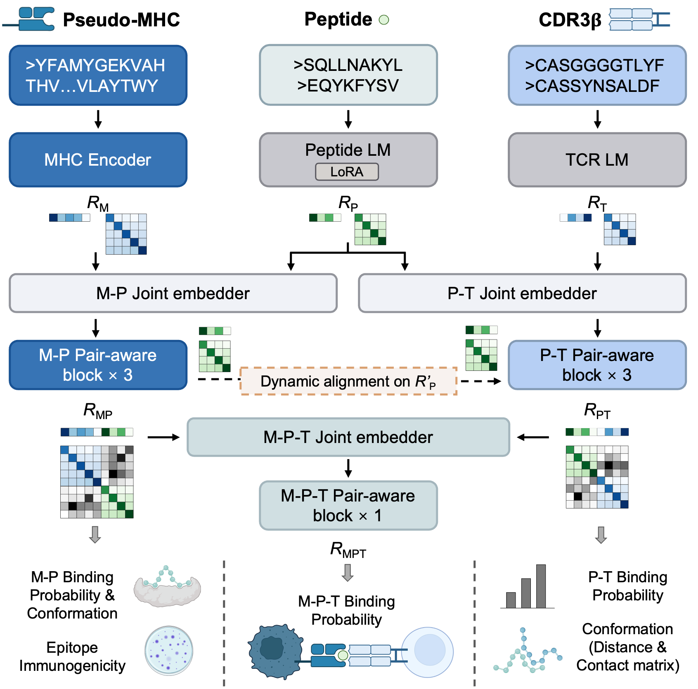

# PepBridge

**PepBridge for peptide-bridged, unified and structure-aware modeling of pMHC-TCR recognition**

## Overview

PepBridge is a peptide-bridged, pair-aware deep learning framework for **unified modeling of the pMHC-TCR recognition cascade**. PepBridge jointly models multiple related tasks and incorporates **structure-aware supervision** through residue-level contact and distance signals.

PepBridge supports:

- peptide-MHC binding prediction
- peptide-TCR binding prediction
- MHC-peptide-TCR binding prediction
- epitope immunogenicity prediction
- residue-level contact and distance map prediction for selected interfaces

This repository provides the model code, inference pipeline, and training utilities for applying PepBridge to pMHC-TCR related prediction tasks.

## Model framework

<p align="center">
  
</p>

---

## Download

You can clone the repository with:

```bash
git clone https://github.com/aapupu/PepBridge.git
cd PepBridge
```

---

## Important note about `esm_emb_HLAI.pkl`

The file `esm_emb_HLAI.pkl` is larger than 100 MB and may not be included in a normal GitHub clone.

You have **two options**:

### Option 1: Download with Git LFS

If the repository tracks this file with Git LFS, install Git LFS first and then pull LFS files:

```bash
git lfs install
git clone https://github.com/aapupu/PepBridge.git
cd PepBridge
git lfs pull
```

### Option 2: Download manually from Zenodo

If you do not use Git LFS, download `esm_emb_HLAI.pkl` separately from **Zenodo** and place it into the `doc/` folder manually:

```text
PepBridge/
└── doc/
    └── esm_emb_HLAI.pkl
```

>
> Zenodo: https://doi.org/10.5281/zenodo.19632906

---

## Environment setup

> The package list below is a suggested template and can be adjusted later according to your local environment.

We recommend using **Python 3.10** or **Python 3.11** with CUDA-enabled PyTorch.

### Create a conda environment

```bash
conda create -n pepbridge python=3.10 -y
conda activate pepbridge
```

### Suggested packages and versions

```bash
pip install torch==2.2.2 torchvision==0.17.2 torchaudio==2.2.2
pip install numpy==1.26.4 pandas==2.2.2 scikit-learn==1.4.2 scipy==1.13.1
pip install matplotlib==3.8 einops==0.8
```

If your local setup requires additional packages, such as ESM or other model-specific dependencies, please install them separately.

---

## Inference

PepBridge supports the following inference tasks:

- `mp`
- `pt`
- `mpt`
- `imm`
- `mp_contact`
- `pt_contact`

It supports running **one or multiple tasks** in a single command.

### Inference features

- binding-related outputs are merged into **one CSV**
- contact predictions are saved as **per-sample matrices**

---

## Input CSV format

The inference script accepts flexible input column names and normalizes them automatically.

### Accepted aliases

- `MHC`, `HLA` → `MHC`
- `peptide`, `epitope` → `peptide`
- `cdr3`, `cdr3b` → `cdr3`
- `v_gene`, `trbv`, `bv`, `tcrbv` → `v_gene`

For HLA-I related tasks, `MHC` will be automatically mapped to pseudo-MHC sequences using `doc/pseudo_HLAI.csv`.

### Required columns by task

#### `mp`
- `MHC`
- `peptide`

#### `imm`
- `MHC`
- `peptide`

#### `pt`
- `peptide`
- `cdr3`

#### `mpt`
- `MHC`
- `peptide`
- `cdr3`
- `v_gene`

#### `mp_contact`
- `MHC`
- `peptide`

#### `pt_contact`
- `peptide`
- `cdr3`

### Example input CSVs

#### For MP / IMM / MP contact

```csv
MHC,peptide
HLA-A24:02,QLPRLFPLL
HLA-A02:01,LLFGYPVYV
```

#### For PT / PT contact

```csv
peptide,cdr3
QLPRLFPLL,CASSLHHEQYF
LLFGYPVYV,CASRPGLMSAQPEQYF
```

#### For MPT

```csv
MHC,peptide,v_gene,cdr3
HLA-A24:02,QLPRLFPLL,TRBV7-9,CASSLHHEQYF
HLA-A02:01,LLFGYPVYV,TRBV5-1,CASRPGLMSAQPEQYF
```

#### For mixed multi-task input

A single CSV can contain all required columns:

```csv
MHC,peptide,v_gene,cdr3
HLA-A24:02,QLPRLFPLL,TRBV7-9,CASSLHHEQYF
HLA-A02:01,LLFGYPVYV,TRBV5-1,CASRPGLMSAQPEQYF
```

---

## Running inference

### Single-task inference

```bash
python infer.py task=mp input_csv=example.csv out_dir=./results
```

### Multi-task inference

```bash
python infer.py task=mp,pt,mpt,mp_contact,pt_contact,imm input_csv=example.csv out_dir=./results
```

---

## Optional arguments

### `batch_size`

Batch size for binding-related tasks:

```bash
python infer.py task=mp,pt,mpt,imm input_csv=example.csv batch_size=32
```

### `contact_batch_size`

Batch size for contact-related tasks:

```bash
python infer.py task=mp_contact,pt_contact input_csv=example.csv contact_batch_size=8
```

### `save_dist`

Whether to save predicted distance matrices for contact tasks:

```bash
python infer.py task=mp_contact input_csv=example.csv save_dist=true
```

### `use_lora`

Whether to load LoRA adapters:

```bash
python infer.py task=mp input_csv=example.csv use_lora=true
```

### `path` or `paths`

Checkpoint path(s):

```bash
python infer.py task=mp input_csv=example.csv path=./doc/checkpoints_multi_lora_align3_ln
```

or

```bash
python infer.py task=mp input_csv=example.csv paths=./ckpt_dir1,./ckpt_dir2
```

---

## Output structure

Assume:

```bash
input_csv=example.csv
out_dir=./results
task=mp,pt,mpt,imm,mp_contact,pt_contact
```

Then the outputs will look like:

```text
results/
├── example_pred.csv
├── mp_contact/
│   ├── <pseudoMHC>_<peptide>_site.csv
│   ├── <pseudoMHC>_<peptide>_dist.csv
│   └── ...
└── pt_contact/
    ├── <peptide>_<cdr3>_site.csv
    ├── <peptide>_<cdr3>_dist.csv
    └── ...
```

### Binding output CSV

All binding-related tasks are merged into **one CSV**.

For example, running:

```bash
python infer.py task=mp,pt,mpt,imm input_csv=example.csv out_dir=./results
```

will produce:

```text
results/example_pred.csv
```

with added columns such as:

- `pred_mp_binding`
- `pred_pt_binding`
- `pred_mpt_binding`
- `pred_immunogenicity`

Only the requested tasks are added.

### Contact output matrices

#### `mp_contact`

Each sample produces:

- `*_site.csv`: predicted contact probability matrix
- `*_dist.csv`: predicted distance matrix, if `save_dist=true`

Rows correspond to pseudo-MHC residues.  
Columns correspond to peptide residues.

#### `pt_contact`

Each sample produces:

- `*_site.csv`
- `*_dist.csv`

Rows correspond to peptide residues.  
Columns correspond to CDR3 residues.

All contact matrices are cropped to the true sequence length.

---

## Example commands

### MP only

```bash
python infer.py task=mp input_csv=example.csv out_dir=./results
```

### PT + PT contact

```bash
python infer.py task=pt,pt_contact input_csv=example.csv out_dir=./results save_dist=true
```

### Full multi-task inference

```bash
python infer.py \
    task=mp,pt,mpt,imm,mp_contact,pt_contact \
    input_csv=example.csv \
    out_dir=./results \
    batch_size=32 \
    contact_batch_size=8 \
    save_dist=true 
```

---

## Citation

PepBridge for peptide-bridged, unified and structure-aware modeling of pMHC-TCR recognition
Wenpu Lai, Yang Li, Oscar Junhong Luo

---

## Contact

For issues, suggestions, or collaboration, please use the GitHub repository issue tracker or contact by e-mail: **kyzy850520@163.com**